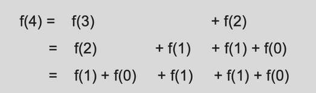
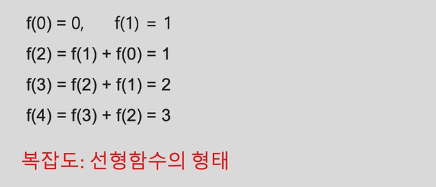
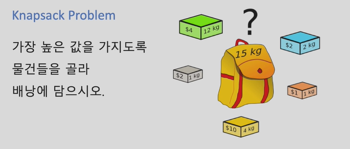

# 3주차 - 힙, 동적계획법, DFS/BFS

## 1. 더 맵게

* 힙을 이용 

* 복잡도 

  * 최악의 경우 : 수가 하나 남을때까지 섞어야 하는 경우 (n-1회)
  * 각 단계에서 요구되는 계산량 : 정렬된 리스트 순서에 맞춰 원소 삽입 - O(n)
  * 전체 문제 풀이의 복잡도  : O(n^2)
  * 지나치게 높은 편 

* 더 나은 방법

  * 최소/최대 원소를 빠르게 꺼내기
  * 힙 : max heap, min heap

  

### 힙

* 성질 : 최대/최소 원소를 빠르게 찾을 수 있음
* 연산
  * 힙 구성(heapify) - O(NlogN)
  * 삽입 (insert) - O(logN)
  * 삭제 (remove) - O(logN)
* 힙의 구현


### 힙의 응용

1. 정렬 (heapsort)
2. 우선 순위 큐 (priority queue)


### python에서 힙의 적용

```
import heapq
heapq.heaify(L)  # 리스트 L로부터 min heap 구성
m = heapq.heappop(L)  # min heap L에서 최소값 삭제 (반환)
heapq.heappush(L, x)  # min heap L에 원소 x 삽입

```


## 2. N으로 표현

### 동적 계획법

주어진 최적화 문제를

재귀적인 방식으로 보다 작은 부분 문제로 나누어

부분 문제를 풀어, 이 해를 조합해

전체 문제의 해답에 이르는 방식


* 알고리즘 진행에 따라 `탐색해야할 범위를 동적으로 결정`함으로써 탐색범위를 한정할 수 있음


### DP 적용 예

* 피보나치 수열 => 재귀 함수로 구현한다면?

  

  복잡도: 지수 함수 형태


* 피보나치 수열 => 동적 계획법을 적용

  

  복잡도가 훨씬 낮아짐


* Knapsack Problem

  ****