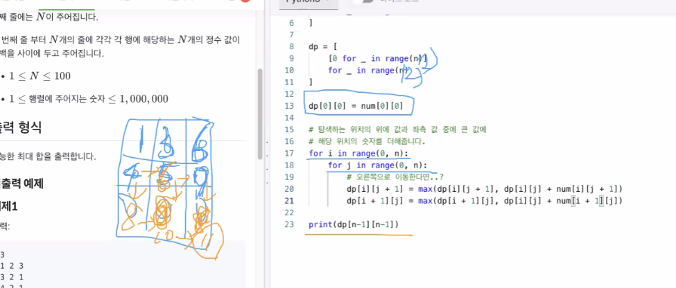

# 모의고사 4

## 2.

## 3. 

특이한 풀이

B라는 Array를 만든다 

B에 왼쪽 수들 중 현재 수와 같은 값이 있으면 그 index를 B에 넣어준다

구간 [i, j]에 대해 B[A[i]]가 j보다 작은지 본다

for 문을 거꾸로 돌려본다

## 5.

sorting후 제일 처음에 만들어지는 문자가 답이 아니란걸 증명하는 반례

## 6.

3자리에서 4자리로 이루어진 수를 구해주세요 하면

f(4)로 가짓수를 구하고 f(2)에서 가짓수를 구해서 둘을 빼면 3~4자리의 4의 배수를 구할 후 있다

정수 사각형 최대합을 뿌려주는 DP로 변경했을 때

