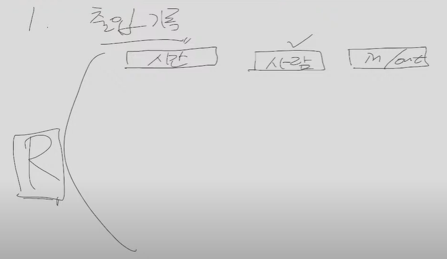
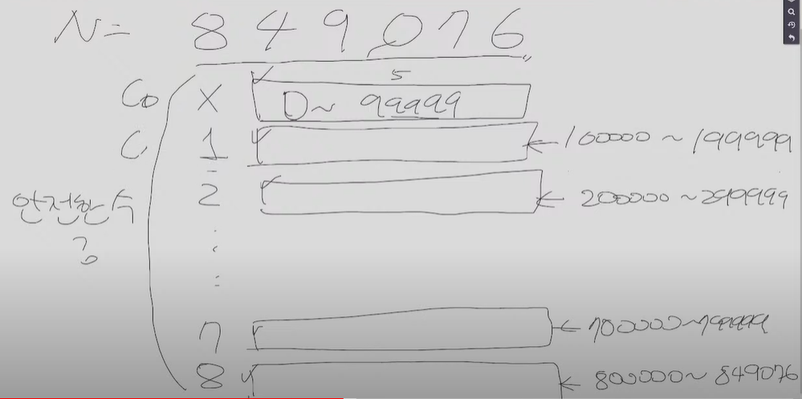
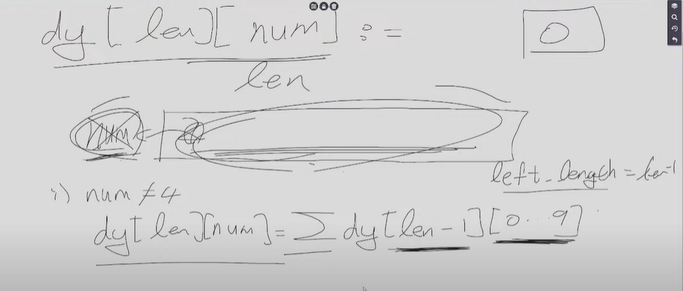
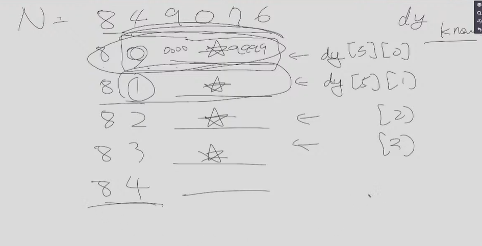

# 현차

## 1. 정렬

R개의 출입기록이 주어짐 

기록마다 시간과 사람, 출입인지 퇴실인지 주어짐

출입기록이 주어졌을 떄 올바르지 않은 사람의 수를 구하는 문제 

N제한이 크지 않음 

### 문제 풀이 (아이디어)

1. 한 사람을 시간순으로 정렬한다
2. 올바른 기록이려면 in/out이 번갈아 등장하면 올바르다 판별할 수 있음
   * in으로 시작 + 번갈아 등장 

## 2. 반복문

N개의 수가 주어지고 목표값인 X가 주어진다

최대 3개의 수를 골라 더해서 X이상의 수 중 최솟값을 구하라

ex ) N개의 수 200 60 30 50 100, X = 140

만약 X이상의 수를 만들 수 없다면 -1 출력

N <= 20

### 문제 풀이

1) 나이브한 풀이

1. 1개 골라서 만들 수 있는 모든 합 찾기

2. 2개 골라 만들 수 있는 " 

3. ...

   X이상의 수 중 최소값 고르기

3중 for문

## 3.

1부터 N까지의 수 중 "47"이 들어가는 수는 제외한다

ex ) 47, 478, 104736, 747, ...

이 수들을 제외한 나머지 수는 몇개인가?

N이 10^100000 

### 문제 풀이 아이디어

1. 시뮬레이션 절대 불가 
2. DP 접근

만약 N이 849076 중 47이 적혀있지 않은 수를 찾자는 예시를 들자

공통점 있는 애들끼리 묶는다

1. 길이가 5인 수들을 묶는다 => 맨 앞에 수는 0-9까지의 수
2. 수들은 0~99999 / 100000 ~ 199999 / 200000 ~ 29999 ... / 800000 ~ 849076 이렇게 묶일 것이다
3. 10 그룹에 대해 따로 수를 센다 C0 ~ C8 까지의 합을 구하면 안전수를 구할 수 있다
4. C0과 C1의 개수는 같을거란걸 예상할 수 있다 
   * 032948이 살아남았다면 132948도 살아남아있음
   * K라는 수가 살아 남아있다면 1이 맨 앞에 있는 1 K 또한 살아남을것
5. 다른 경우
   1. C4를 제외한 C들의 수는 전부 같다
   2. C8과 C7의 개수도 다르다 (C8은 주어진 수의 맨앞자리 그룹)
6. 8로 시작하는 그룹으로 또 나눠준다
   * 8 0, 8 1, 8 2, 8 3, 8 4
   * 그 앞 4자리의 안전수 계산
7. 84로 시작하는 그룹으로 또 나눔
   * 8 4 0 / 8 4 1 / 8 4 2 / ... / 8 4 8 / 8 4 9
8. 8 4 9 0 으로 시작하는 그룹으로 또 나눔 ... 반복

---

`dy[len][num] : 길이가 len이면서 제일 높은 차수에 num인 수 중 안전한 수`

`dy[3][2] =  200 ~ 299` : 47제외한 99개

`dy[3][4] = 400 ~ 499 ` : 447, 470~479 제외한 89개

0포함시킨 초기값,

#### 점화식

`dy[1][0...9] = 1로 초기화`

맨 앞 수를 num, num + 남은자리수 = len

1) num != 4 => num이 없어도 안전 

​	`dy[len][num] = Edy[len-1][0...9]`

2) nun = 4 , 4□□□□

​	`dy[len][4] = Edy[len-1][0, 1, 2, 3, 4, 5, 6, 8, 9]만 세준다 (7제외)`

