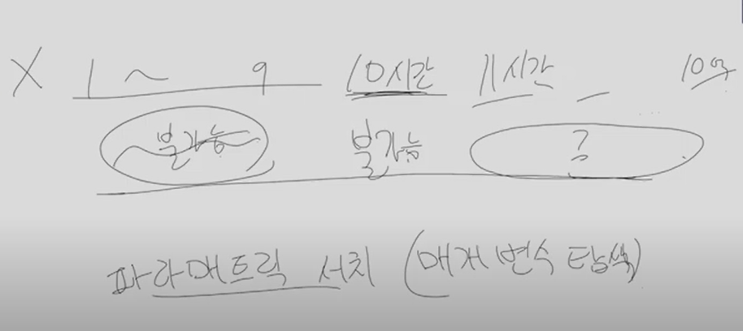

# 0504 플그여름

## 1.  간단 구현

이차원배열이 주어진다

4배로 키워야한다

1. 오른쪽기준 뒤집기

2. 아래기준 뒤집기

   2-1. 뒤집은거 오른쪽 기준으로 다시 뒤집기

### 풀이방법

(i, j)가 좌우반전하면 어디에 있을까를 생각하기

함수만들기!

1. 오른쪽 기준으로 뒤집기

   * 0 ~ j => j' ~ n-1

   * 길이는 j - 0 + 1 == N - 1 - j ' + 1

   * 즉 j' = N-1-j

   * (i, j) => (i, N-1-j) 로 이동한다

     

2. 상하반전
   * (i, j) => (N-1-i, j)
3. 상하반전 => 좌우반전
   * 상하반전 함수, 좌우반전 함수 사용

## 2. 재귀

카드가 N장있다. 각 카드는 각자 가격이 존재한다.

각 카드는 각자의 가격이 존재한다

N : 5 (<= 10)

시작 숫자 : S <= 10000

가격: 500 700 200 600 300

식 : + 50  x3  x6   +60   +10

예산 : M원 (10억)

카드를 적절하게 순서 고려해서 구매

같은 카드는 최대한 1번만 구매할 수 있다

어떤 순서로 카드를 사야 내가가진 숫자가 커질 수 있을까?

더하기, 곱하기 우선순위 상관하지 않고 카드를 살때마다 식 바로 적용해야함

((s + 50) * 60)

### 문제 풀이

n의 수가 작다 => 완전탐색이 가능하다

n장의 카드 순서 고려해서 나열하는 경우의 수 : N!  / 10! = 360만

만약 n이 크다면??  N : 20~25라면 DP가 되는 선까지는 n을 키울 수 있다

더하기 카드, 곱하기 카드 들중 **더하기카드를 먼저사는게 무조건 이득!**

**더하기에 어느정도를 투자하고 곱하기에 어느정도를 투자하는것이 중요**

**곱하기를 제일 크게 만드는것은 로그를 씌우면 로그들의 덧셈으로 바뀜 => 결국 덧셈문제 2개 푸는걸로 바뀜**

n이 10인게 적당한 취준문제

=> 재귀 함수 사용

## 3.  우선순위 큐, 파라매트릭 서치(매개변수 탐색) (어려운 문제)

숙제 N개 (<= 2만)가 주어진다

각 숙제마다 기한이 주어진다 (s: 출제되는날, e:마감되는날) (0 <= s <= e <= 364)

숙제에 써야하는 할당시간 h도 주어진다 (h <= 100만)

목적 : 모든 숙제를 다해야한다

**하루 중 제일 많이 일한시간이 최소값이길 바란다**

ex ) X = 3 하루 세시간까지만 공부를 할 수 있다

0일 : A숙제 3시간

1일 : A숙제 1시간, B숙제 2시간

2일 : B숙제 0시간, C숙제 3시간 => 왜 C를 해야할까

​			C는 마감이 임박했기 때문에 

3일 : B숙제 3시간 ===> **근데 B숙제를 끝내지 못함**

ex) X = 4

0일 : A 4

1일 : B 4

2일 : B1, C3

3일 : B2, D2

4일 : D 3

### 문제풀이

하루에 일할 수 있는 시간이 정해져있다해도 이 시간으로 모든 숙제 다할 수 있어?라는 질문에도 답을 못하기 때문에 어려움

20만개 숙제를 365일만에 다할 수 있어?라는 질문에 답할 수 없음 => 어렵게 느껴짐

#### 접근방법

1. 하루에 일할 수 있는 시간이 짧을수록 곤란, 길수록 널널
2. 특정시점(X)으로 그거보다 짧으면 불가능하고, 길면 가능하다고 생각할 수 있다

3. **단조 형태**를 이루고 있는 배열에서 처음으로 가능하다는 **경계에 서있는 구간**에서 가능한 값이 정답이다 라는걸 알 수 있다

왜 파라매트릭 서치를 써야하는지를 모르는 사람들이 많다! => **단조형태**

결정문제로 변경!

하루 X시간 쓸 때 모든 숙제 가능 / 불가능한지 판단하는 문제!

0일 ~ 364일중 내가 선택할 수 있는 날이 여러개일 때 

ex) 10일날을 선택했다 했을 때 중요한건 언제 할지가 아니라 **언제 끝날지!**

숙제A가 내일종료되고, 숙제 B가 모레 종료된다이때는, A를 먼저 끝내는게 좋다!

근데 A가 10시간 남고, B가 100시간 남았다면 결정 요인에 영향을 주나?! => **NO** 

빨리 끝낼수록 당장 시간을 투자해야하는게 무조건 최선이다

빨리 끝나는것부터 최대한 빨리 투자하면 숙제를 끝낼 수있다

#### 풀이

바구니 안에 당장 할 수 있는 숙제들의 집합이 들어있다

0일날 할 수 있는 숙제, 1일날 할 수 있는 숙제 ...

**바구니의 역할**

1. 삽입
2. 지금 할 수 있는 숙제들 중 가장 빨리 마감되는 숙제 뽑아내기

=> 이런 연산이 가능한 것은 **우선순위큐!**

