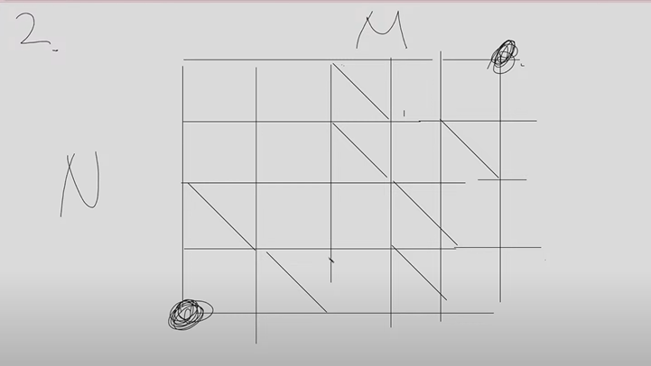

# 0609 ㅇㅌㅋ

## 1.  (Easy)

N개의 저축상품이 있다.

각 저축상품마다 순이익이 주어진다 (%단위)

첫번째 상품은 10%, 두번째 상품은 20%, 세번째 상품은 5%

처음에 X1으로 시작하는데, K년동안 1년에 하나의 상품을 정해서 이익을 얻으려 한다

연간 순이익이 10만원 이하이길 바란다

K년동안 매년 저축상품중 단 하나만 선택하려면 어떤걸 골라야할까

### 문제풀이

반복문, 조건문 사용

## 2. (Medium)

N*M 배열이 주어진다

왼쪽아래에서 오른쪽 위로 이동하고 싶다

이때 몇몇격자에는 왼쪽위에서 오른쪽 아래로 가로지르는 대각선이 존재한다

최단거리로 이동을 하되 대각선을 정확히 1번 이용한 방법의 경우의 수를 구해야한다

