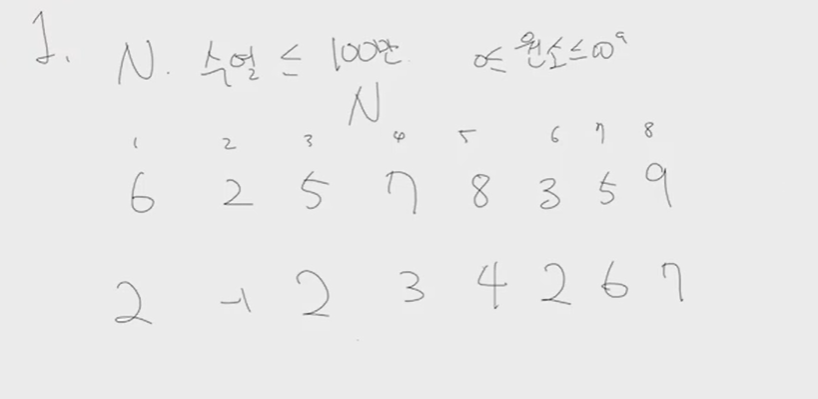

# 0627 초콜릿의 뇌

## 1. 

"백준 2393 탑 풀어보기"

길이 N수열 [6 2 5 7 8 3 5 9]주어짐

각 위치마다 해당 숫자보다 작으면서, 가장 가까이 있는 숫자 찾아야함

예를들어 5인 경우, 5보다 작은 숫자는 2와 3이 있음 그중 2가 가장 가까우므로 2를 출력

그런데 8같은 경우는 같은 거리에 작은 수들이 있다. 이 경우에는 왼쪽에 있는 수를 출력

자신보다 작은 수가 없는 경우엔 -1 출력

N의 수열의 길이는 <=100만, 0 <= 원소 <= 10^9

### 풀이 과정

해야하는 것

1. 모든 위치마다 자신의 왼쪽에서 자신보다 작으며 가장 가까운 위치 찾기
2. 모든 위치마다 자신의 오른쪽에서 자신보다 작으며 가장 가까운 위치 찾기

1, 2 결과를 모두 알고있다면, 둘 중에 가장 가까운걸 알 수 있다

