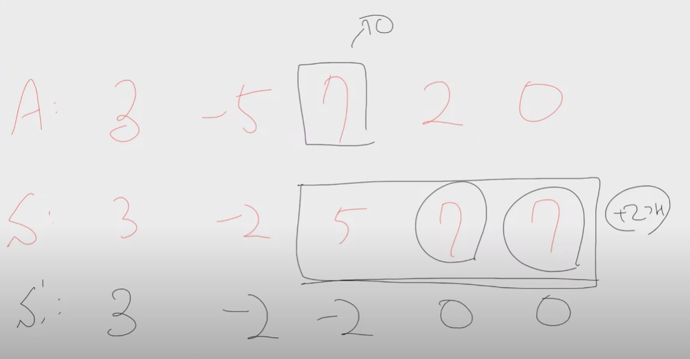
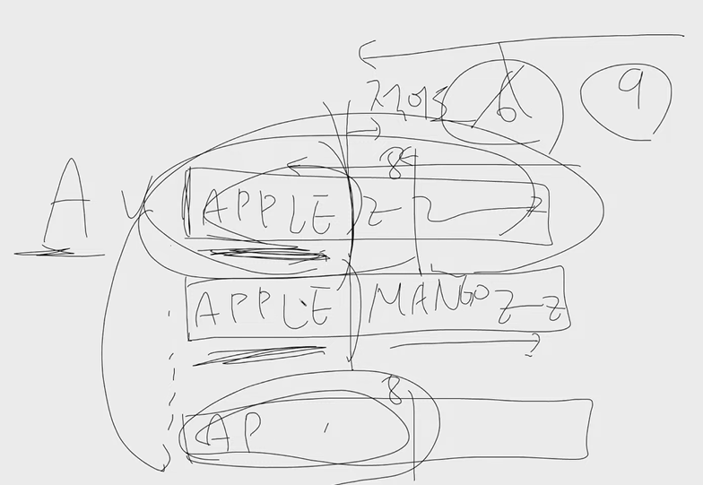

# 220823, 230228 auto

## 220823 1. 

2022/08/23 해당 날짜를 작성하는 법은 여러가지다

20220823 (YYYYMMDD)

08232022 (MMDDYYYY)

23082022 (DDMMYYYY)

8글자 특정한 날짜를 받았을 때 "2022?823"

?에 어떤 숫자가 와야 유효한 날짜가 되는가?

(1950/1/1 ~ 204912/31) 까지가 유효한 날짜고 4의 배수는 윤년이다

여러가지 숫자가 될 수 있으면라면 ?

불가능 X

가능이면 날짜의 YYYYMMDD폼 출력

### 풀이

1) 2?2?09?8 이 주어진 경우 ?채워보기 완전탐색 => 매 경우마다 되는지 확인하기

=> O(10^8) 

근데 2개 이상 된다 판별되면 중단할거라 10^8까지느 안나올것

1. 완전탐색
2. 윤년탐색
3. 날짜 탐색

2) 반대로 날짜를 전체 다 보는 방법 => 시뮬레이션

1950/01/01 ~ 2049/12/31 모든 날짜를확인한다

각 날짜마다 세가지 형태 (YYYYMMDD, MMDDYYYY, DDMMYYYY)다 써보기 

입력으로 주어진 문자열이랑 비교했을 때 ?자리를 제외한 숫자가 동일하면 통과

=> O(365 * 100 * 3) => O(10^5)

## 232208 2. 

N개의 수가 있는 수열이 주어진다

-10억부터 10억사이의 원소들이 들어온다, 원소의 개수는 20만개 이하

[3, -5, 7, 2, -2] 왼쪽부터 누적합을 누한다

=> 3, -2, 5, 7, 5 

누적합에 0을 최대한 많이 등장시키고 싶다

수열 A에서 최대 1개만 숫자를 0으로 바꿀 수 있다

7을 0으로 만든다면 누적합이

=> 3, -2, -2, 0, -2 가된다

어떤 수를 0으로 바꿔야 0이 가장 많이 등장하는지 구하라

완전탐색의 경우 N^2의 시간이 걸리게 된다 (불가능)

### 풀이방법

A배열의 k번째 숫자를 0으로 바꾸고 싶을 때 생기는 누적합의 변화는 K의 왼쪽까지는 변화가 없고, 오른쪽 누적합에 변화가 있을 것

k부터 n번째까지만 0이 몇번등장할지 새로 구해주면 될 것임

k번째수=5, 누적합이 Sk라면, Sk-5가될것임, 그 다음은 Sk+1 - 5. Sk+2 - 5 ... 이 될것임

 5를 뺀애들중에 0이 몇번있냐는 0을 빼기 전에 누적합에 5가 몇번있었냐랑 질문이 같아짐

## 4.

길이가 동일한 20자 이하의 문자열 n개(<=5000)가 주어진다

APPLEZZ..ZZ    => APPL

APPSTORE.Z   => APPS 

APPEND.... Z   => APPE 

AIR...		   Z   => AIRZ

AIRPLANE...Z   => AIRP

맨앞의 글자를 4글자씩으로 압축했을 때 어떠한 압축한 글자들이 종속관계에 있지 않는다

 2개의 글자 앞에 5개가 똑같다면 종속되어있음을 뜻하고 최소 6개부터 글자를 잘라야한다

앞이 8개까지 똑같은 글자를 발견한다면 8개보다 작거나 같은 문자로 자르면 안된다 => 최소 9글자 이하로 압축됨

A글자와 B글자가 10글자까지 동일하다면, 11글자부터 유니크해진다

각 문자열마다 앞쪽 PREFIX가 가장 긴 문자길이를 찾으면 된다

TRIE라는 자료구조를 사용해도 된다

SUBTREE에 각 문자열이 저장됐는가 등을 써도 되는데

TRIE자료구조를 모르는 경우에 `정렬`을 사용하면 도움이 된다

가장 비슷한 친구를 찾아야하는데 사전순 정렬을 했다면 바로 앞이나 바로 뒤중에 하나가 해당글자와 가장 비슷하다는걸 알수 있다 

I-1번째와 I+1번째랑 비교하고 둘중에 더 긴친구를통해 압축해야하는 길이를 정해준다 

